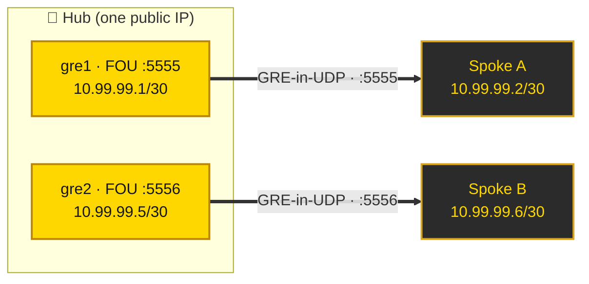

<p align="center">
  
</p>

<p align="center">
  
  
  
  
  
</p>

<h3 align="center">🥇 GRE tunnels that survive networks which drop native GRE — wrapped in UDP, tuned for loss, managed by systemd.</h3>

<p align="center"><i>Build a point-to-point or hub-and-spoke overlay between Linux servers, even across providers/transit that filter IP protocol 47.</i></p>

---

## ✨ Why Golden GRE?

Plain GRE rides **IP protocol 47**. Many budget hosts, mobile carriers, and national transit paths **silently drop proto 47** — the tunnel comes "up" on both ends but **zero payload crosses**. You only notice when every ping times out.

**Golden GRE** wraps GRE inside UDP using the Linux **FOU** (Foo-over-UDP) encapsulation. To the network it looks like ordinary UDP, so it passes wherever UDP passes — while you keep a real `greN` L3 interface to route over.

On top of transport it ships the **production glue** a raw `ip tunnel` command leaves out:

- 🥇 **Punches through proto-47 filtering** — GRE-in-UDP via FOU.
- ⚡ **Loss-tolerant by default** — BBR congestion control + `fq`, so a lossy long-haul path doesn't collapse TCP (CUBIC halves its window on every loss; BBR doesn't).
- 🧱 **Forwarding-ready** — `ip_forward`, FORWARD accept, and **TCP MSS clamping** so forwarded TCP never blackholes on PMTUD.
- 🔁 **Reboot-persistent** — one **systemd template unit** (`golden-gre@<name>`) brings every tunnel back on boot.
- 🌐 **Hub & spoke** — run many tunnels on one box; each is an isolated instance (own device, UDP port, /30, config).
- 🧩 **Config-driven** — one small file per tunnel in `/etc/golden-gre/`. No IPs baked into scripts.

---

## 📜 Table of Contents

- [How it works](#-how-it-works)
- [Requirements](#-requirements)
- [Quick start](#-quick-start)
- [Configuration reference](#-configuration-reference)
- [Running multiple tunnels (hub & spoke)](#-running-multiple-tunnels-hub--spoke)
- [Routing & NAT through the tunnel](#-routing--nat-through-the-tunnel)
- [Performance & tuning](#-performance--tuning)
- [Verifying with iperf3](#-verifying-with-iperf3)
- [Troubleshooting](#-troubleshooting)
- [Security notes](#-security-notes)
- [How it works under the hood](#-how-it-works-under-the-hood)
- [License](#-license)

---

## 🛠 How it works



Each end runs the same recipe:

1. A **FOU listener** decapsulates incoming UDP on a chosen port back into GRE.
2. A `greN` device sends its GRE frames **inside UDP** to the peer's FOU port.
3. The kernel routes your traffic over `greN` like any other L3 interface.

Because the wire payload is UDP, proto-47 filtering never sees a GRE packet to drop.

---

## 📦 Requirements

- **Linux** with `fou` and `ip_gre` kernel modules (stock on Ubuntu 22.04/24.04, Debian, most distros).
- `iproute2`, `iptables`, `systemd`.
- Root on both ends.
- **UDP reachability** between the two public IPs on your chosen port(s). (That's the whole point — UDP gets through where GRE doesn't.)
- A free **/30** per tunnel for the overlay, and a unique **UDP port** + **device name** per tunnel on any shared host.

Check modules:

```bash
modprobe fou && modprobe ip_gre && echo "ready"
```

---

## 🚀 Quick start

A two-server, point-to-point tunnel.

```bash
# --- on BOTH servers ---
git clone https://github.com/LivingG0D/Golden-GRE.git
cd Golden-GRE
sudo ./install.sh
```

```bash
# --- on SERVER 1 (e.g. 203.0.113.10) ---
sudo tee /etc/golden-gre/link.conf >/dev/null <<'EOF'
DEV=gre1
LOCAL_PUB=203.0.113.10
REMOTE_PUB=198.51.100.20
TUN_ADDR=10.99.99.1/30
FOU_PORT=5555
MTU=1400
EOF
sudo systemctl enable --now golden-gre@link
```

```bash
# --- on SERVER 2 (e.g. 198.51.100.20) ---
sudo tee /etc/golden-gre/link.conf >/dev/null <<'EOF'
DEV=gre1
LOCAL_PUB=198.51.100.20
REMOTE_PUB=203.0.113.10
TUN_ADDR=10.99.99.2/30
FOU_PORT=5555
MTU=1400
EOF
sudo systemctl enable --now golden-gre@link
```

Test it:

```bash
ping 10.99.99.2   # from server 1
```

That's a reboot-persistent, loss-tolerant, forwarding-ready tunnel. 🥇

---

## ⚙️ Configuration reference

One file per tunnel: `/etc/golden-gre/<name>.conf`. `<name>` is the systemd instance (`golden-gre@<name>`).

| Key | Required | Example | Meaning |
|-----|:--------:|---------|---------|
| `DEV` | ✅ | `gre1` | Tunnel device name. **Unique per host.** |
| `LOCAL_PUB` | ✅ | `203.0.113.10` | This server's public IP (GRE/FOU underlay source). |
| `REMOTE_PUB` | ✅ | `198.51.100.20` | Peer's public IP. |
| `TUN_ADDR` | ✅ | `10.99.99.1/30` | This end's overlay address. Peer takes the other host in the /30. |
| `FOU_PORT` | ✅ | `5555` | UDP port for GRE-in-UDP. **Unique per tunnel** on a shared host. Both ends use the same port. |
| `MTU` | ⬜ | `1400` | Tunnel MTU. Default `1400` (safe under a 1500 underlay: 20 IP + 8 UDP + 4 GRE overhead). |
| `ROUTES` | ⬜ | `"192.0.2.0/24 198.18.0.0/24"` | Space-separated CIDRs to route via this tunnel. |
| `NAT_SRC` | ⬜ | `10.99.99.0/30` | If set, MASQUERADE this source out `NAT_OUT` (use this node as an internet exit). |
| `NAT_OUT` | ⬜ | `eth0` | Egress interface for `NAT_SRC`. Defaults to `eth0`. |

> 📝 IPs above use the RFC 5737 documentation ranges. Replace with your real values **in `/etc/golden-gre/` on each host** — never commit them.

---

## 🌐 Running multiple tunnels (hub & spoke)

One hub can terminate many tunnels at once. Give each its **own device, UDP port, and /30**:

```bash
# hub: tunnel to spoke A
sudo tee /etc/golden-gre/spoke-a.conf >/dev/null <<'EOF'
DEV=gre1
LOCAL_PUB=203.0.113.10
REMOTE_PUB=198.51.100.20
TUN_ADDR=10.99.99.1/30
FOU_PORT=5555
EOF

# hub: tunnel to spoke B
sudo tee /etc/golden-gre/spoke-b.conf >/dev/null <<'EOF'
DEV=gre2
LOCAL_PUB=203.0.113.10
REMOTE_PUB=192.0.2.30
TUN_ADDR=10.99.99.5/30
FOU_PORT=5556
EOF

sudo systemctl enable --now golden-gre@spoke-a golden-gre@spoke-b
```

The FOU listeners stack on the hub (`:5555` **and** `:5556`); the kernel demuxes return traffic to the right device by peer IP. Manage them independently — restarting one never touches the other:

```bash
systemctl status golden-gre@spoke-a golden-gre@spoke-b
systemctl restart golden-gre@spoke-b      # spoke-a stays up
```

---

## 🔀 Routing & NAT through the tunnel

**Route a remote subnet** over a tunnel — add to its conf:

```bash
ROUTES="10.50.0.0/24"
```

**Use a node as an internet exit** (e.g. send the overlay's traffic out the USA box):

```bash
# in the exit node's conf
NAT_SRC="10.99.99.4/30"
NAT_OUT=eth0
```

`ROUTES` and `NAT_SRC` are applied on `up` and cleaned on `down`. `ip_forward` and the MSS clamp are already in place, so forwarded TCP keeps a correct MSS and won't stall on a path-MTU black hole.

---

## ⚡ Performance & tuning

`install.sh` drops [`sysctl/99-golden-gre.conf`](sysctl/99-golden-gre.conf):

| Setting | Value | Why |
|---------|-------|-----|
| `tcp_congestion_control` | `bbr` | **The headline fix.** On a lossy long-haul path, CUBIC reads every drop as congestion and collapses; BBR paces to the measured bottleneck and ignores non-congestive loss. |
| `default_qdisc` | `fq` | BBR's pacing companion. |
| `tcp_rmem` / `tcp_wmem` max | `128 MiB` | Big enough send/receive windows to fill a high-BDP (high latency × bandwidth) link. |
| `tcp_mtu_probing` | `1` | Recover gracefully if path MTU is below expectations. |
| `ip_forward`, `forwarding` | `1` | Route through the tunnel. |

> 💡 **Real-world impact:** on a path with ~0.5–0.7% loss, switching the *sender* from CUBIC to BBR took a tunnel from **~30 Mbit/s to ~1 Gbit/s**. Loss is a property of the path; BBR just stops over-reacting to it.

---

## 🔬 Verifying with iperf3

```bash
# peer (server):
iperf3 -s -B 10.99.99.2

# this end (client) — TCP both directions:
iperf3 -c 10.99.99.2            # forward
iperf3 -c 10.99.99.2 -R         # reverse
# UDP loss / jitter:
iperf3 -c 10.99.99.2 -u -b 300M
```

Healthy signs: ping at the raw path RTT with ~0% loss, TCP that climbs and holds, UDP loss in the sub-percent range with low jitter. High TCP retransmits **with sustained throughput** are normal under BBR on a lossy path — that's BBR doing its job, not a fault.

---

## 🩺 Troubleshooting

| Symptom | Likely cause | Check / fix |
|---------|--------------|-------------|
| Device is `UP` but ping 100% loss | Native GRE leaking, or wrong FOU port | Confirm `ip fou show` lists your port; `tcpdump -ni eth0 udp port <FOU_PORT>` should show traffic both ways. |
| UDP leaves one side, never arrives | Provider blocks that UDP port | Try another `FOU_PORT` (both ends). |
| TCP crawls, ping is fine | Sender not on BBR | `sysctl net.ipv4.tcp_congestion_control` → should be `bbr`. Re-run `sudo sysctl --system`. |
| Forwarded TCP connects then stalls | PMTU black hole | MSS clamp present? `iptables -t mangle -S FORWARD | grep mss`. Lower `MTU`. |
| Gone after reboot | Unit not enabled | `systemctl is-enabled golden-gre@<name>`. |
| `RTNETLINK: File exists` | Stale device/addr | `systemctl restart golden-gre@<name>` (down/up is idempotent). |

Logs: `journalctl -u golden-gre@<name>`.

---

## 🔐 Security notes

- **Golden GRE is unencrypted** — like GRE itself. The overlay protects nothing on the wire. If you need confidentiality, run it **inside** WireGuard/IPsec, or treat the tunnel purely as transport for already-encrypted traffic.
- **Never commit real configs.** Your per-host IPs live in `/etc/golden-gre/` and are intentionally outside this repo. `.gitignore` guards against accidental secret/`.env` commits.
- Restrict the FOU UDP port to the peer IP with your firewall if you want to reduce exposure.

---

## 🧠 How it works under the hood

```text
        ┌──────────── your packet ────────────┐
        │ inner IP | TCP/UDP/ICMP | payload    │      rides gre1 (L3)
        └──────────────────────────────────────┘
                         │  GRE encap (+4 bytes)
                         ▼
        ┌─────── GRE ───────┬──── inner packet ────┐
        └────────────────────┴──────────────────────┘
                         │  FOU encap (+8 UDP, +20 outer IP)
                         ▼
   ┌ outer IP (LOCAL_PUB→REMOTE_PUB) | UDP :FOU_PORT | GRE | inner ┐
   └───────────────────────────────────────────────────────────────┘
                         │
                         ▼  looks like plain UDP — proto-47 filters see nothing to drop
```

The receiving FOU socket strips the UDP, reinjects the GRE, and the matching `greN` device delivers your inner packet. Overhead is **24 bytes** vs. native GRE's encap-less 4 (hence `MTU=1400`).

---

## 📄 License

[MIT](LICENSE) © [LivingG0D](https://github.com/LivingG0D)

<p align="center"><sub>🥇 <b>Golden GRE</b> — because a tunnel that drops your packets isn't a tunnel.</sub></p>
