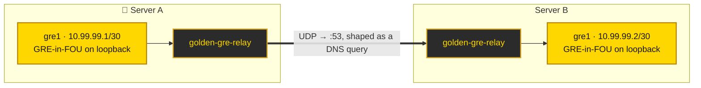

<p align="center">
  
</p>

<p align="center">
  
  
  
  
  
</p>

<p align="center">
  <a href="https://github.com/LivingG0D/Golden-GRE/actions/workflows/ci.yml"></a>
</p>

<h3 align="center">🥇 GRE tunnels for IPv4 paths that cut tunnels — GRE rides inside a DNS-shaped relay, so it passes where GRE, WireGuard, QUIC and TCP tunnels are cut.</h3>

<p align="center"><i>A real <code>greN</code> L3 interface between Linux servers, tuned for loss, managed by systemd, measured at 140–160 Mbit/s on a path that kills every ordinary tunnel.</i></p>

---

## ✨ Why Golden GRE?

Some IPv4 paths between countries do not just drop GRE (IP protocol 47). They **cut every flow after the first few packets**: a tunnel comes up, a ping or two goes through, and then nothing — whether the packets are GRE, GRE-in-UDP (FOU), WireGuard, VXLAN, QUIC or a TCP stream. One measured path let through only **ICMP** and **UDP to port 53 that carries a valid DNS message**. [docs/FILTER.md](docs/FILTER.md) has the measurements for every method.

**Golden GRE** keeps GRE as the tunnel (a real `greN` interface you route over) and carries it through a small **relay** that makes the wire traffic look like DNS queries to port 53 (or ICMP). To that path it is ordinary DNS; to your routing table it is a point-to-point link.

On top of transport it ships the **production glue** a raw `ip tunnel` command leaves out:

- 🥇 **Passes where native tunnels are cut** — measured 138 Mbit/s down / 153 up / 161 with four flows, 144 Mbit/s over a 5-minute soak, on a path where plain GRE, FOU, GUE, IPIP, VXLAN, Geneve and WireGuard carried nothing.
- ⚡ **Loss-tolerant by default** — BBR congestion control + `fq`, so a lossy long-haul path doesn't collapse TCP (CUBIC halves its window on every loss; BBR doesn't).
- 🧱 **Forwarding-ready** — `ip_forward`, a FORWARD accept inserted ahead of Docker/ufw's DROP policy, and **TCP MSS clamping** so forwarded TCP never blackholes on PMTUD.
- 🔁 **Reboot-persistent** — one **systemd template unit** (`golden-gre@<name>`) brings every tunnel back on boot and restarts it if the relay dies.
- 🌐 **Several tunnels per host** — each is an isolated instance (own device, GRE key, ports, /30, config, and public address).
- 🩺 **Health check** — a timer pings the peer through the tunnel and leaves a failed unit when nothing answers.
- 🧩 **Config-driven** — one small file per tunnel in `/etc/golden-gre/`. No IPs baked into scripts.
- 📊 **A benchmark that proves it on your path** — [`bench/`](bench) tests every method over two servers of yours and prints the table.

---

## 🛠 How it works


```mermaid
flowchart LR
    subgraph A["🥇 Server A"]
      GA["gre1 · 10.99.99.1/30<br/>GRE-in-FOU on loopback"] --> RA["golden-gre-relay"]
    end
    subgraph B["Server B"]
      RB["golden-gre-relay"] --> GB["gre1 · 10.99.99.2/30<br/>GRE-in-FOU on loopback"]
    end
    RA == "UDP → :53, shaped as a DNS query" ==> RB

    classDef gold fill:#FFD700,stroke:#B8860B,stroke-width:2px,color:#161616;
    classDef spoke fill:#2b2b2b,stroke:#DAA520,stroke-width:2px,color:#FFD700;
    class GA,GB gold;
    class RA,RB spoke;
```

Each end runs the same recipe:

1. `golden-gre-up.sh` builds a `greN` device whose peer is **loopback**: GRE inside FOU (UDP), sent to a local relay port, with a loopback-only FOU listener to receive from it.
2. `golden-gre-relay` (the unit's main process) takes each datagram the tunnel sends, wraps it as a DNS query (a header, one question, and an EDNS0 record whose data is the datagram) and sends it from an ephemeral port to the peer's relay on UDP/53.
3. The peer's relay checks the shape and the source address, unwraps it, and hands the datagram to its own FOU listener, which decapsulates the GRE.
4. The kernel routes your traffic over `greN` like any other L3 interface.

An **ICMP facade** (`FACADE=icmp`, unsolicited echo replies) is also built in. On the measured path it passed too, but reordered heavily at higher rates and was slower than DNS.

---

## 📦 Requirements

- **Linux** with `fou` and `ip_gre` kernel modules (stock on Ubuntu 22.04/24.04, Debian, most distros).
- `iproute2`, `iptables`, `systemd`, and **`gcc`** (build time only: `install.sh` compiles the relay).
- `ethtool` — turns GSO off on the tunnel device. **Install it.** The call is deliberately non-fatal, so without it the step is skipped silently, and with GSO on the kernel hands the relay datagrams of up to 64 KB.
- Root on both ends.
- **IPv4 only**, with one **public address per tunnel on each host**: the relay binds `LOCAL_PUB:53`, so tunnels that share a host need different `LOCAL_PUB` addresses (or a different `DNS_PORT`, if your path allows it).
- A free **/30** per tunnel for the overlay, and a unique **device name, `GRE_KEY`, `FOU_PORT` and `RELAY_PORT`** per tunnel on a shared host.

Check modules:

```bash
modprobe fou && modprobe ip_gre && echo "ready"
```

---

## 🚀 Quick start

A two-server, point-to-point tunnel.

```bash
# --- on BOTH servers ---
git clone https://github.com/LivingG0D/Golden-GRE.git
cd Golden-GRE
sudo ./install.sh
```

```bash
# --- on SERVER 1 (e.g. 203.0.113.10) ---
sudo tee /etc/golden-gre/link.conf >/dev/null <<'EOF'
DEV=gre1
LOCAL_PUB=203.0.113.10
REMOTE_PUB=198.51.100.20
TUN_ADDR=10.99.99.1/30
EOF
sudo systemctl enable --now golden-gre@link
```

```bash
# --- on SERVER 2 (e.g. 198.51.100.20) ---
sudo tee /etc/golden-gre/link.conf >/dev/null <<'EOF'
DEV=gre1
LOCAL_PUB=198.51.100.20
REMOTE_PUB=203.0.113.10
TUN_ADDR=10.99.99.2/30
EOF
sudo systemctl enable --now golden-gre@link
```

Test it:

```bash
golden-gre-preflight link   # sanity-check modules, relay binary, port & config (before starting)
ping 10.99.99.2             # from server 1
```

That's a reboot-persistent, loss-tolerant, forwarding-ready tunnel. 🥇

---

## 📥 What gets installed

`install.sh` must run as root and is **idempotent** — re-run it any time to upgrade in place. It touches exactly these paths and nothing else:

| Path | Mode | What it is |
|------|:----:|------------|
| `/usr/local/sbin/golden-gre-relay` | `0755` | The relay, compiled from `relay/golden-gre-relay.c` |
| `/usr/local/sbin/golden-gre-up.sh` | `0755` | Builds one tunnel's device and firewall state |
| `/usr/local/sbin/golden-gre-down.sh` | `0755` | Tears one tunnel down |
| `/usr/local/sbin/golden-gre-relay.sh` | `0755` | Runs the relay for one tunnel from its config |
| `/usr/local/sbin/golden-gre-preflight` | `0755` | Readiness checker (installed from `scripts/preflight.sh`) |
| `/usr/local/sbin/golden-gre-check` | `0755` | Liveness check: pings the peer's overlay address |
| `/etc/systemd/system/golden-gre@.service` | `0644` | The systemd template unit |
| `/etc/systemd/system/golden-gre-check@.{service,timer}` | `0644` | Optional per-tunnel health-check timer |
| `/etc/sysctl.d/99-golden-gre.conf` | `0644` | BBR/`fq`, buffers, IPv4 forwarding — applied immediately via `sysctl --system` |
| `/etc/golden-gre/` | `0750` | Directory for your per-tunnel configs (created empty) |

No packages are installed, no existing network configuration is rewritten, and no tunnel starts until you create a config and enable an instance.

> ⚠️ **Upgrading a host that runs tunnels from an older Golden GRE** (direct GRE-in-UDP or an IPv6 underlay): the new `golden-gre@.service` has a different shape, and `golden-gre-up.sh` rejects IPv6 endpoints and the old keys. Do not run `install.sh` over live tunnels of the old kind; stop them first and convert each config (see the keys below).

---

## ⚙️ Configuration reference

One file per tunnel: `/etc/golden-gre/<name>.conf`. `<name>` is the systemd instance (`golden-gre@<name>`). One `KEY=VALUE` per line; the shell scripts source it.

| Key | Required | Example | Meaning |
|-----|:--------:|---------|---------|
| `DEV` | ✅ | `gre1` | Tunnel device name. **Unique per host.** |
| `LOCAL_PUB` | ✅ | `203.0.113.10` | This server's public IPv4 address. The relay binds it. |
| `REMOTE_PUB` | ✅ | `198.51.100.20` | Peer's public IPv4 address. |
| `TUN_ADDR` | ✅ | `10.99.99.1/30` | This end's overlay address. Peer takes the other host in the /30. |
| `FACADE` | ⬜ | `dns` | What the wire traffic looks like: `dns` (UDP/53, default) or `icmp`. Same on both ends. |
| `DNS_PORT` | ⬜ | `53` | `dns` facade: UDP port on both ends. Only 53 passed on the measured path. |
| `MTU` | ⬜ | `1380` | Tunnel MTU. Default `1380`. Overhead on the wire is 75 bytes with the `dns` facade (20 IP + 8 UDP + 39 DNS + 8 GRE), 36 with `icmp`. |
| `GRE_KEY` | ⬜ | `41` | GRE key. **Must match on both ends.** Default `41`. Tunnels on one host need different keys (the kernel finds a tunnel by endpoints and key, and every tunnel here has the same loopback endpoints). |
| `RELAY_PORT` | ⬜ | `5601` | Loopback UDP port between the tunnel and the relay. **Unique per tunnel** on a host. |
| `FOU_PORT` | ⬜ | `5599` | Loopback FOU listener port. **Unique per tunnel** on a host; `up` refuses a port another tunnel holds. |
| `ROUTES` | ⬜ | `"192.0.2.0/24 198.18.0.0/24"` | Space-separated CIDRs to route via this tunnel. |
| `NAT_SRC` | ⬜ | `10.99.99.0/30` | If set, MASQUERADE this source out `NAT_OUT` (use this node as an internet exit). |
| `NAT_OUT` | ⬜ | `eth0` | Egress interface for `NAT_SRC`. Unset: any interface except the tunnel itself. |
| `PEER_ADDR` | ⬜ | `10.99.99.2` | Peer's overlay address for `golden-gre-check`. Unset: derived as the other host of a /30 or /31 `TUN_ADDR`. |

> 📝 IPs above use the RFC 5737 documentation ranges. Replace with your real values **in `/etc/golden-gre/` on each host** — never commit them.

---

## 🎛 Managing tunnels

Every tunnel is an independent systemd instance named after its config file (`/etc/golden-gre/link.conf` → `golden-gre@link`):

```bash
systemctl enable --now golden-gre@link    # start now + on every boot
systemctl restart golden-gre@link         # full down/up — safe, both are idempotent
systemctl stop golden-gre@link            # tear down, still enabled at boot
systemctl disable --now golden-gre@link   # tear down + don't come back
systemctl status golden-gre@link
journalctl -u golden-gre@link -n 50
```

The unit is `Type=simple`: **the relay is its main process**. `ExecStartPre` builds the device and firewall state, `ExecStopPost` removes them, and `Restart=always` brings everything back if the relay dies or if bringup fails (for example when the underlay is not ready yet at boot — `up` then exits before creating anything and systemd retries every 5 s). It also carries `ConditionPathExists=/etc/golden-gre/%i.conf`, so an instance whose config is missing is **skipped rather than failed**.

The relay logs one line a minute (`tx=… rx=… bad=…`): packets sent to the peer, packets delivered to the tunnel, and frames rejected (wrong shape). `bad` growing means something other than the peer is sending to the relay's port.

### Without systemd

```bash
sudo golden-gre-up.sh link                 # device + firewall state
sudo golden-gre-relay.sh link &            # the relay, in the foreground otherwise
sudo golden-gre-down.sh link               # after stopping the relay
```

`up` deletes and recreates the device, so running it twice is fine. `down` ignores anything that's already gone and always exits `0`, so it's safe in teardown scripts. It does not stop the relay: under systemd that is the unit's job.

### Preflight

```bash
golden-gre-preflight          # host readiness only
golden-gre-preflight link     # ...plus validate /etc/golden-gre/link.conf
```

It verifies `fou`/`ip_gre` are loadable, `ip`/`iptables` and the relay binary are present, reports `tcp_congestion_control` and `ip_forward`, and — given an instance name — confirms the required keys are set, `LOCAL_PUB` is an address of this host, and the relay's UDP port is free. **Hard failures exit `1`; advisories only warn.** Run it before starting the tunnel: once the relay runs, it correctly reports its own port as in use.

It never tests the actual path. It prints the `tcpdump` command to run on the peer.

### Health check

A tunnel unit stays `active` even when the peer is dead or the path starts cutting the disguise. `golden-gre-check` catches that: it pings the peer's overlay address through `greN` and exits `1` when nothing answers.

```bash
golden-gre-check link                           # one-off
systemctl enable golden-gre-check@link.timer    # every minute while golden-gre@link runs
systemctl --failed                              # a dead tunnel shows up here
journalctl -u golden-gre-check@link             # history of ok / DOWN
```

The timer is tied to the tunnel: once enabled it starts whenever `golden-gre@link` starts and stops when it stops. It only reports — restarting can't fix a filtered path. Point your monitoring at the unit's failed state.

---

## 🌐 Running multiple tunnels

Give each tunnel its **own device, /30, `GRE_KEY`, `FOU_PORT`, `RELAY_PORT` and `LOCAL_PUB`** (the relay binds `LOCAL_PUB:53`, so two tunnels cannot share an address):

```bash
# hub: tunnel to spoke A (the hub's first address)
sudo tee /etc/golden-gre/spoke-a.conf >/dev/null <<'EOF'
DEV=gre1
LOCAL_PUB=203.0.113.10
REMOTE_PUB=198.51.100.20
TUN_ADDR=10.99.99.1/30
GRE_KEY=41
FOU_PORT=5599
RELAY_PORT=5601
EOF

# hub: tunnel to spoke B (the hub's second address)
sudo tee /etc/golden-gre/spoke-b.conf >/dev/null <<'EOF'
DEV=gre2
LOCAL_PUB=203.0.113.11
REMOTE_PUB=192.0.2.30
TUN_ADDR=10.99.99.5/30
GRE_KEY=42
FOU_PORT=5600
RELAY_PORT=5602
EOF

sudo systemctl enable --now golden-gre@spoke-a golden-gre@spoke-b
```

Each spoke runs an ordinary point-to-point config pointed back at the hub, with the **same `GRE_KEY`** as its hub-side tunnel. Manage them independently — restarting one never touches the other, and `up` refuses a `FOU_PORT` another tunnel holds rather than sharing it.

---

## 🔀 Routing & NAT through the tunnel

**Route a remote subnet** over a tunnel — add to its conf:

```bash
ROUTES="10.50.0.0/24"
```

**Use a node as an internet exit** (e.g. send the overlay's traffic out the USA box):

```bash
# in the exit node's conf
NAT_SRC="10.99.99.4/30"
# NAT_OUT=eth0   # optional; unset masquerades out any interface but the tunnel
```

`ROUTES` and `NAT_SRC` are applied on `up` and cleaned on `down`. `ip_forward`, the FORWARD accept, and the MSS clamp are already in place, so forwarded TCP keeps a correct MSS and won't stall on a path-MTU black hole.

---

## ⚡ Performance & tuning

`install.sh` drops [`sysctl/99-golden-gre.conf`](sysctl/99-golden-gre.conf):

| Setting | Value | Why |
|---------|-------|-----|
| `tcp_congestion_control` | `bbr` | On a lossy long-haul path, CUBIC reads every drop as congestion and collapses; BBR paces to the measured bottleneck and ignores non-congestive loss. |
| `default_qdisc` | `fq` | BBR's pacing companion. |
| `tcp_rmem` / `tcp_wmem` max | `128 MiB` | Big enough send/receive windows to fill a high-BDP (high latency × bandwidth) link. |
| `tcp_mtu_probing` | `1` | Recover gracefully if path MTU is below expectations. |
| `ip_forward` | `1` | Route through the tunnel. IPv4 only on purpose: enabling IPv6 forwarding makes the kernel ignore Router Advertisements, which drops a SLAAC-configured IPv6 default route. |

Measured on one filtered path (round trip about 82 ms, a 2-vCPU server with 30–45% CPU steal on one end): single TCP flow 138 Mbit/s down and 153 up, 161 with four flows, 0.014% UDP loss, 144 Mbit/s averaged over five minutes. The relay and kernel together used about a quarter of the smaller server at 150 Mbit/s. Full tables: [docs/FILTER.md](docs/FILTER.md).

---

## 🔬 Verifying with iperf3

```bash
# peer (server):
iperf3 -s -B 10.99.99.2

# this end (client) — TCP both directions:
iperf3 -c 10.99.99.2            # forward
iperf3 -c 10.99.99.2 -R         # reverse
# UDP loss / jitter:
iperf3 -c 10.99.99.2 -u -b 100M
```

Healthy signs: ping at the raw path RTT with ~0% loss, TCP that climbs and holds, UDP loss in the sub-percent range. High TCP retransmits **with sustained throughput** are normal under BBR on a lossy path.

---

## 📊 Benchmark: prove it on your own path

[`bench/`](bench) measures every tunnel method over two servers of yours (SSH as root with a key) and prints the table behind [docs/FILTER.md](docs/FILTER.md). The two addresses go in `bench/hosts.env` (git-ignored; copy `bench/hosts.env.example`).

```bash
bench/carriers.sh                      # which carriers survive, both directions
bench/filter.sh basic|expiry|rate|icmp|mimic|sustain [from] [to]
bench/localize.sh udp IR TR            # packet counts on both NICs: is the drop in transit?
bench/measure.sh gre-dns-c             # bring up one tunnel, measure, tear down
bench/matrix.sh gre-dns-c wg-dns-c     # several methods, one table
bench/soak.sh gre-dns-c 300            # sustained transfer + drop counters
bench/cleanup.sh                       # remove everything the benchmark can leave behind
```

Everything a test creates lives under `/tmp/tb` on the servers (device `tb0`, overlay `10.77.61.0/30`, FOU port 5698, relay port 5701, iptables comment `tmp-tb`, nft table `tbhop`), so it never touches a running `golden-gre@` tunnel. The DNS-facade methods bind UDP/53, so **stop `golden-gre@…` on both servers before running them**.

---

## 🧰 Tools

[`tools/xui-set-outbound-address.sh <old> <new> [outbound_tag]`](tools/xui-set-outbound-address.sh) points an x-ui VLESS outbound at a new address — for example a Golden GRE tunnel's overlay address. It backs up the x-ui database and the outbound, edits only that outbound's address in the panel template (so a restart keeps it), hot-swaps it into the running xray without a restart, and writes `/root/golden-gre-rollback.sh`.

---

## 🩺 Troubleshooting

| Symptom | Likely cause | Check / fix |
|---------|--------------|-------------|
| Unit won't start: `… is not configured on this host yet` / `no route to …` | Early boot, or a wrong address | systemd retries every 5 s. If it persists, `LOCAL_PUB` is not an address of this host. |
| `FOU port … is already in use` | Another tunnel holds that `FOU_PORT` | Give each tunnel on the host its own `FOU_PORT`, `RELAY_PORT` and `GRE_KEY`. |
| Relay exits: `bind: Address already in use` | Something else holds `LOCAL_PUB:53` (another tunnel, a DNS server) | `ss -lun 'sport = :53'`; use another `LOCAL_PUB` or stop the other listener. `golden-gre-preflight <name>` reports it. |
| `RTNETLINK answers: File exists` | Another tunnel with the same `GRE_KEY` on this host, or a stale device | Different `GRE_KEY` per tunnel; otherwise `systemctl restart golden-gre@<name>`. |
| Device `UP`, ping 100% loss, relay line shows `tx` growing, `rx` flat | The path cuts the disguise, or the peer's relay isn't running | `tcpdump -ni any udp port 53` on the peer should show queries arriving; run `bench/carriers.sh` to see what your path passes. |
| `bad` grows in the relay line | Something else sends well-formed-looking junk to the relay's port | Harmless, rejected before delivery. Firewall the port to the peer if it bothers you. |
| Ping passes, bulk traffic crawls | Sender not on BBR, or MTU too high for your path | `sysctl net.ipv4.tcp_congestion_control` → `bbr`; lower `MTU`. |
| Forwarded TCP connects then stalls | PMTU black hole | MSS clamp present? `iptables -t mangle -S FORWARD` (look for `mss`). Lower `MTU`. |
| Gone after reboot | Unit not enabled | `systemctl is-enabled golden-gre@<name>`. |
| `LOCAL_PUB and REMOTE_PUB must be IPv4 addresses` | An IPv6 address in the config | The relay transport is IPv4. |

Logs: `journalctl -u golden-gre@<name>`.

---

## 🔁 WireGuard

GRE is unencrypted. [docs/WireGuard.md](docs/WireGuard.md) covers WireGuard as the encrypted alternative, including running it **through the same relay** (129 Mbit/s down, 108 up, 141 with four flows on the measured path), diagnosing a WireGuard tunnel that goes silent, and bonding several tunnels past a per-flow UDP policer.

---

## 🧹 Uninstall

```bash
# 1. stop and disable every tunnel first (this tears down the devices)
systemctl disable --now 'golden-gre-check@*.timer' 'golden-gre@*'

# 2. remove the installed files
sudo rm -f /usr/local/sbin/golden-gre-relay \
           /usr/local/sbin/golden-gre-up.sh \
           /usr/local/sbin/golden-gre-down.sh \
           /usr/local/sbin/golden-gre-relay.sh \
           /usr/local/sbin/golden-gre-preflight \
           /usr/local/sbin/golden-gre-check \
           /etc/systemd/system/golden-gre@.service \
           /etc/systemd/system/golden-gre-check@.service \
           /etc/systemd/system/golden-gre-check@.timer \
           /etc/sysctl.d/99-golden-gre.conf
sudo systemctl daemon-reload
sudo sysctl --system >/dev/null

# 3. your tunnel configs — only if you're really done
sudo rm -rf /etc/golden-gre
```

⚠️ Step 2 reverts `bbr`/`fq`, the enlarged buffers, **and `ip_forward`** to your distro defaults. If anything else on the box (Docker, a VPN, another router role) depends on forwarding, set it explicitly in its own `/etc/sysctl.d/` file before you remove ours.

---

## 🧪 Development

Bash, one small C program, no other build step. CI ([`.github/workflows/ci.yml`](.github/workflows/ci.yml)) runs on every push to `main` and every PR:

| Job | What it enforces |
|-----|------------------|
| **Lint & sanity** | Every script lints clean under ShellCheck (`-x`); the Python helpers compile; the relay builds with `-Wall -Wextra -Werror`; every script under `scripts/`, `tests/` and `install.sh` starts with `#!/usr/bin/env bash` and is committed executable; the example config defines its required keys and uses only RFC 5737 addresses. |
| **End-to-end** | Runs `install.sh`, then [`tests/relay.sh`](tests/relay.sh) (two relays on loopback: both directions, bulk delivery, payload sizes, non-peer frames ignored, both facades), then [`tests/e2e.sh`](tests/e2e.sh): two network namespaces act as two servers and bring real tunnels up with the real scripts and relays. It checks the first packet already passes, the loopback-only FOU listener, `GRE_KEY`, the routes, that the FORWARD/MSS/NAT/INPUT rules exist exactly once after a re-run (and that no DROP lands on the DNS port), a 20 MB transfer bit for bit, that a failing re-run leaves a live tunnel up, that `golden-gre-check` passes and a mismatched key blocks traffic, that a tunnel reusing another's FOU port is refused without touching it, a second tunnel on the same hosts, the `icmp` facade, rollback after a failed or interrupted bringup, `up` failing before creating anything when the address or route is missing, and IPv6 endpoints rejected. |
| **systemd wiring** | [`tests/systemd.sh`](tests/systemd.sh) on the runner's real systemd: the unit runs the relay as its main process and builds the device around it, an enabled `golden-gre-check@` timer starts and stops with its tunnel, a failing check leaves the unit `failed`, and stopping the unit removes the device and ends the relay. |

Reproduce locally (the tests need root, `iptables`, `ethtool`, `curl`, `gcc`; the e2e test needs a kernel with FOU, which WSL2's default kernel lacks):

```bash
shellcheck -x scripts/*.sh tests/*.sh install.sh bench/*.sh bench/remote/*.sh tools/*.sh
sudo tests/relay.sh
sudo tests/e2e.sh
```

`tests/systemd.sh` installs and starts real units, so it is meant for a throwaway machine like the CI runner.

[`.gitattributes`](.gitattributes) pins LF endings on everything that executes on Linux, so contributing from Windows can't ship a CRLF shebang that fails with `bad interpreter`.

---

## 🔐 Security notes

- **Golden GRE is unencrypted** — like GRE itself, and the disguise adds none. The overlay protects nothing on the wire. If you need confidentiality, run WireGuard through the relay ([docs/WireGuard.md](docs/WireGuard.md)), or treat the tunnel purely as transport for already-encrypted traffic (TLS, VLESS+Reality).
- **Never commit real configs or addresses.** Your per-host IPs live in `/etc/golden-gre/` and `bench/hosts.env`, both outside version control (`.gitignore` covers `*.conf` and `bench/hosts.env`).
- **The relay answers nothing.** It accepts a frame only if its source address is `REMOTE_PUB` and its shape is right, and delivers it to the tunnel; everything else is counted in `bad` and dropped. It never replies to a scan. Binding UDP/53 on a public address will still draw scanners: the INPUT rule opens the port to the peer only on hosts whose policy is DROP, and adds no DROP of its own (a local resolver may share the port).
- **That does not stop spoofing.** A blind attacker who forges `REMOTE_PUB` and the frame shape can still inject datagrams toward the tunnel. The GRE key rejects blind injection (without the key the kernel drops the packet) but travels in cleartext. For authenticated traffic use WireGuard through the relay.
- The tunnel device is trusted for forwarding: `up` accepts everything routed in or out of `greN`. Filter inside the overlay if the peer shouldn't reach everything this host can.

---

## 🧠 How it works under the hood

```text
        ┌──────────── your packet ────────────┐
        │ inner IP | TCP/UDP/ICMP | payload    │      rides gre1 (L3)
        └──────────────────────────────────────┘
                         │  GRE encap (+8 bytes with a key)
                         ▼
                         │  FOU encap to loopback (the relay's port)
                         ▼
                         │  relay: strip UDP/IP, wrap as a DNS query (+39 bytes)
                         ▼
   ┌ outer IP (LOCAL_PUB→REMOTE_PUB) | UDP :53 | DNS header+question+OPT | GRE | inner ┐
   └──────────────────────────────────────────────────────────────────────────────────┘
                         │
                         ▼  looks like a DNS query — a path that cuts anything else passes it
```

The peer's relay checks the source and shape, strips the DNS wrapper, and hands the GRE datagram to its loopback FOU socket, which decapsulates it for the matching `greN` device. Overhead is **75 bytes** with the `dns` facade (20 outer IP + 8 UDP + 39 DNS + 8 GRE with key), so a 1500-byte underlay fits an MTU up to 1425; the default `MTU=1380` leaves headroom. The `icmp` facade costs 36.

Earlier versions put GRE-in-UDP (FOU) directly on the wire, and later added plain GRE over an IPv6 underlay. Both are in the git history; on the path measured here neither survived the filter over IPv4.

---

## 📄 License

[Apache 2.0](LICENSE) © [LivingG0D](https://github.com/LivingG0D)

<p align="center"><sub>🥇 <b>Golden GRE</b> — because a tunnel that drops your packets isn't a tunnel.</sub></p>
